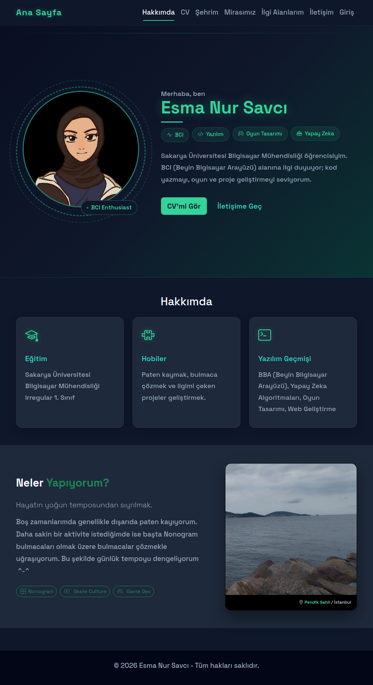
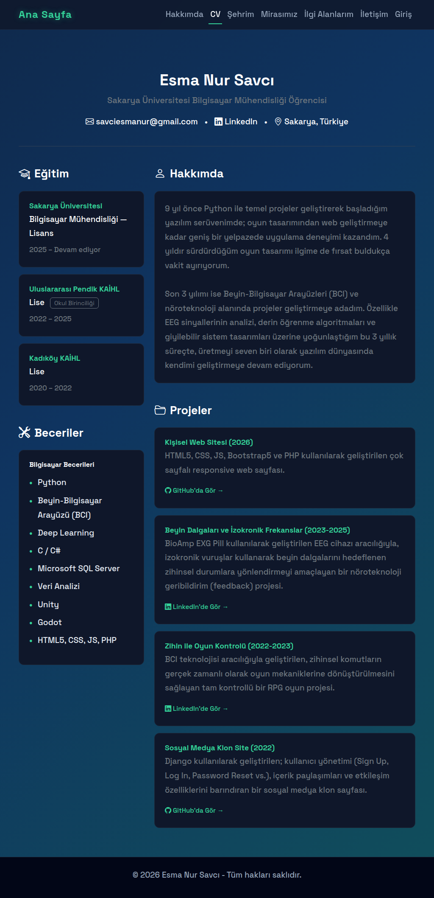
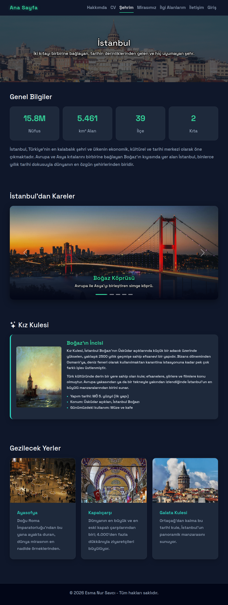
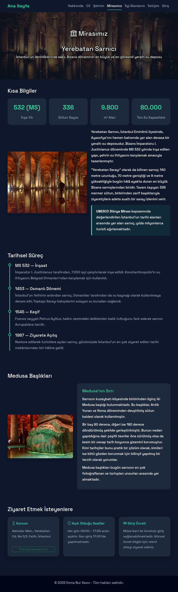
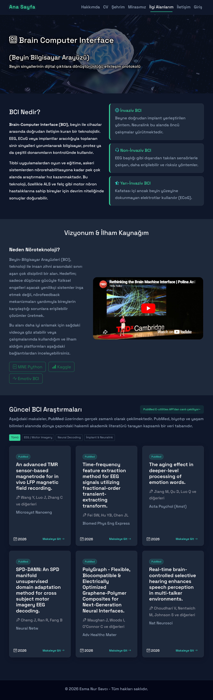
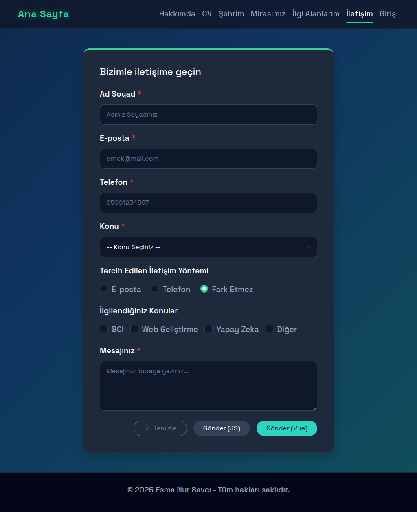
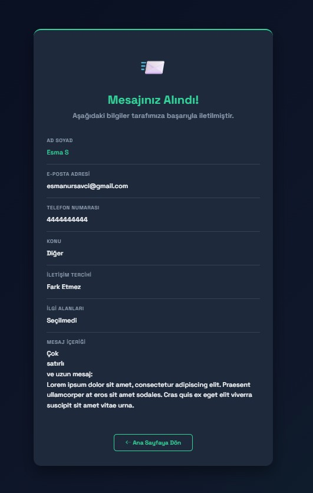
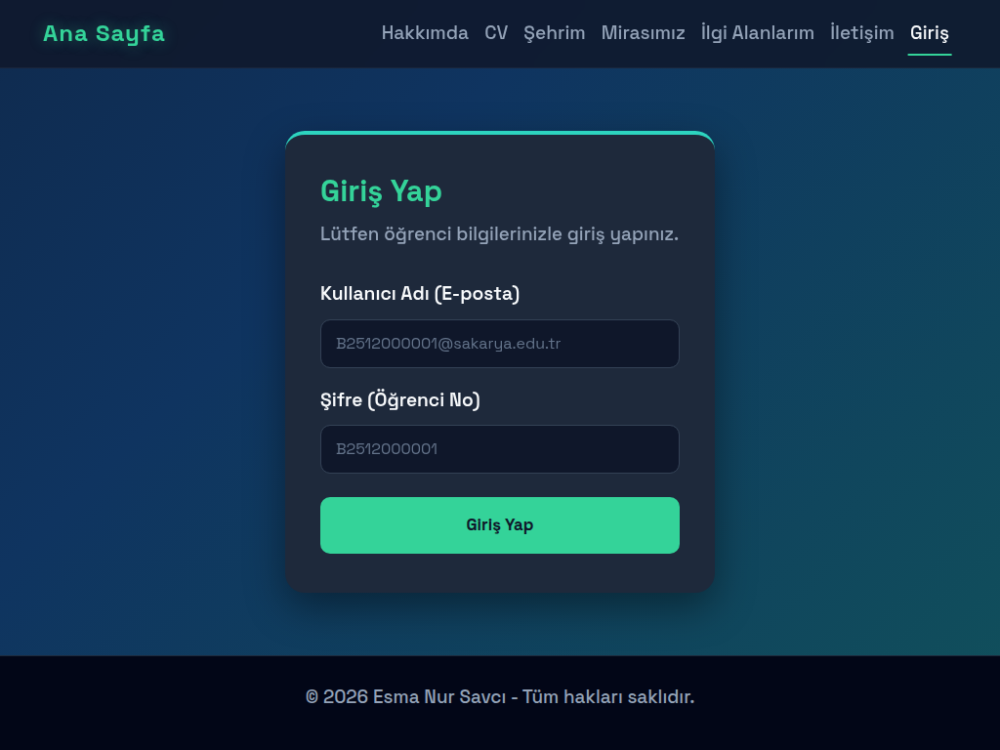
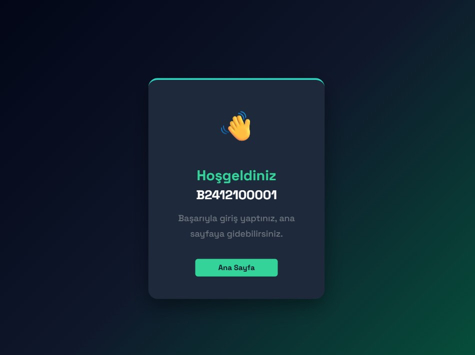
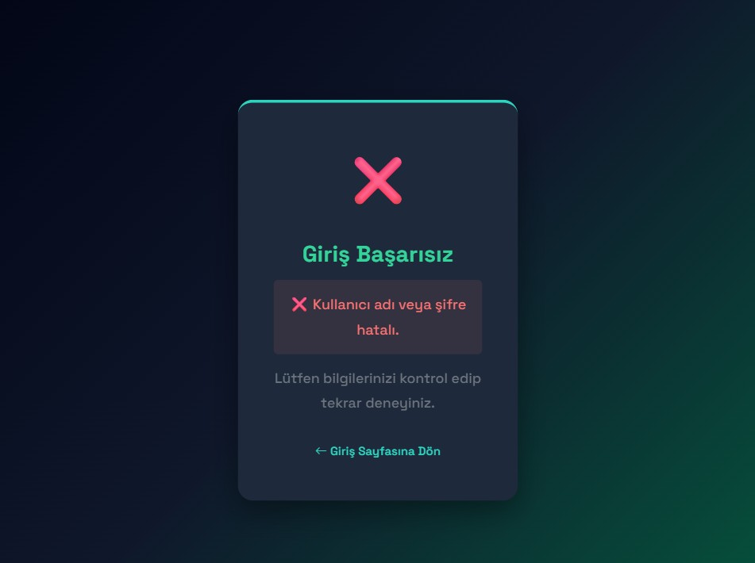

  <h1>SAKARYA ÜNİVERSİTESİ</h1>
  <h2>BİLGİSAYAR MÜHENDİSLİĞİ BÖLÜMÜ</h2>
  <h3>2025-2026 BAHAR DÖNEMİ</h3>
  <h4>WEB TEKNOLOJİLERİ DERSİ PROJE ÖDEVİ A GRUBU</h4>

 

**Öğrenci Adı Soyadı:** Esma Nur Savcı  
**Öğrenci Numarası:** B251210008 

**Canlı Site Linki:** [https://esmanursavci.42web.io/home.html](https://esmanursavci.42web.io/home.html)  
**Github Repository Linki:** [https://github.com/savci-esma-bci/Proje-Web-Teknolojileri-26.git](https://github.com/savci-esma-bci/Proje-Web-Teknolojileri-26)

---

# Proje Hakkında

Bu proje, modern web geliştirme standartlarına uygun olarak modüler ve responsive bir yapıda geliştirilmiştir.

* **Frontend (İstemci Tarafı):** HTML5 (Semantik), CSS3, JavaScript
* **CSS Framework:** Bootstrap 5
* **Backend (Sunucu Tarafı):** PHP

---

# Sayfalar ve Anlatım

## 1. Hakkında (home.html) Sayfası

### İçerik: Kişisel bilgilerim ve hobilerim  ile ziyaretçiyi karşılayan ana sayfadır.
### Teknik Altyapı: Bootstrap 5.3.3 + özel CSS dosyası; koyu tema CSS değişkenleri, keyframe animasyonları ve responsive breakpoint'ler içerir.

## 2. Özgeçmiş (cv.html) Sayfası

### İçerik: Eğitim geçmişi, teknik beceriler ve projeleri listeleyen iki sütunlu özgeçmiş sayfasıdır.
### Teknik Altyapı: Bootstrap 5.3.3 iki sütunlu grid (col-lg-4 / col-lg-8); özel cv-card, cv-section-title, skills-list bileşenleri ve style.css tema değişkenleri kullanılır.

## 3. Şehrim (sehrim.html) Sayfası

### İçerik: İstanbul'u tanıtan sayfa; info kartları, beş fotoğraflı Bootstrap carousel, Kız Kulesi özel bölümü ve üç kart halinde gezilecek yerlerden oluşur.
### Teknik Altyapı: Bootstrap carousel bileşeni (otomatik geçişli, oklar ve indikatörler dahil), info-badge, place-card, kiz-kulesi-card özel sınıfları ve style.css tema değişkenleri kullanılır.

## 4. Mirasımız (miras.html) Sayfası

### İçerik: Yerebatan Sarnıcı'nı anlatan sayfa; bilgi kartları, tarihsel süreç zaman çizelgesi, Medusa başlıklarının açıklaması ve ziyaretçi bilgilerinden (konum, saat, ücret) oluşur.
### Teknik Altyapı: Bootstrap grid ve stat-box, timeline, medusa-card, highlight-box gibi özel CSS bileşenleri; görseller Wikimedia Commons'tan harici URL ile yüklenir (hero fotosu hariç).

## 5. İlgi Alanlarım (interest.html) Sayfası

### İçerik: BCI teknolojisini (invaziv/non-invaziv/yarı-invaziv türleriyle) açıklayan sayfa; vizyon metni, YouTube embed ve PubMed'den canlı çekilen akademik makale kartlarından oluşur.
### Teknik Altyapı: api.js ile PubMed E-utilities API'ye fetch isteği atılır; filtre butonları sorguyu dinamik olarak değiştirir. Bootstrap grid, bci-card, paper-card, filter-btn özel sınıfları kullanılır.

## 6. İletişim Formu (iletisim.html) Sayfası

### İçerik: Ad soyad, e-posta, telefon, konu seçimi, iletişim tercihi (radio), ilgi alanları (checkbox) ve mesaj alanlarından oluşan iletişim formudur. Form php/form-isle.php'ye POST eder.
### Teknik Altyapı: Vue 3 (createApp) ile reaktif form state ve vueValidate, native JS ile nativeValidate olmak üzere iki gönderme butonu bulunur. Hata yönetimi form-kontrol.js'de, is-error sınıfı ile sağlanır.

## 7. Kullanıcı Girişi (login.html) Sayfası

### İçerik: Öğrenci e-postası ve şifresiyle giriş yapılan tek kartlık sayfadır. Form php/login-isle.php'ye POST eder.
### Teknik Altyapı: login-val.js submit olayını dinler; boş alan ve regex e-posta kontrolü yaparak hataları #loginError div'inde gösterir. Sunucu tarafında login-isle.php, sabit kimlik bilgisiyle karşılaştırma yaparak sonuç sayfasını render eder.
